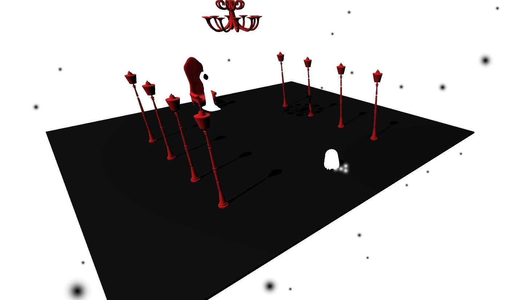

# StillWorlds
A simple 3D game made in Unity for Wowie Game Jam 3.

## Story
The DEATH itself has brought you to its sacred place. Will you follow the orders or shall you make your own path in discovering the truth of your origin. Wander the little worlds of Still Worlds and find out.

## Screenshots

## Youtube video (making a game in 3 days)

## Itch

https://nikolagameshouse.itch.io/still-worlds

## Music credits

- Cyborg Rock by Stefan Kartenberg (c) copyright 2020 Licensed under a Creative Commons Attribution Noncommercial  (3.0) license. http://dig.ccmixter.org/files/JeffSpeed68/62602 Ft: Javolenus
- resonance by airtone (c) copyright 2020 Licensed under a Creative Commons Attribution Noncommercial  (3.0) license. http://dig.ccmixter.org/files/airtone/61321 
- nightRain by airtone (c) copyright 2017 Licensed under a Creative Commons Attribution license. http://dig.ccmixter.org/files/airtone/55887 
- theSantaAnasInstrumental by airtone (c) copyright 2017 Licensed under a Creative Commons Attribution Noncommercial  (3.0) license. http://dig.ccmixter.org/files/airtone/55711 
- fragmentedReality by airtone (c) copyright 2013 Licensed under a Creative Commons Attribution Noncommercial  (3.0) license. http://dig.ccmixter.org/files/airtone/43353 Ft: Kara Square, Timberman
- In the clouds by Stefan Kartenberg (c) copyright 2019 Licensed under a Creative Commons Attribution Noncommercial  (3.0) license. http://dig.ccmixter.org/files/JeffSpeed68/59123 Ft: Javolenus
- Päncake (Instrumental) by Aussens@iter (c) copyright 2018 Licensed under a Creative Commons Attribution Noncommercial  (3.0) license. http://dig.ccmixter.org/files/tobias_weber/58046 Ft: Zep Hurme
- We Silently Surf the Gentle Sun (ft. Blue Wave Theory) by Ivan Chew (c) copyright 2016 Licensed under a Creative Commons Attribution (3.0) license. http://dig.ccmixter.org/files/ramblinglibrarian/54313 

## Sound effects credits:

- https://www.zapsplat.com/
